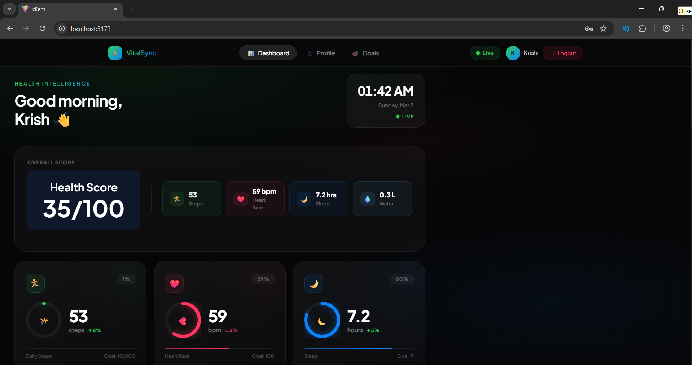
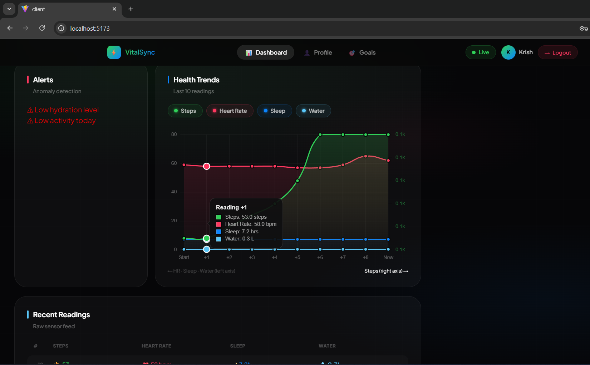
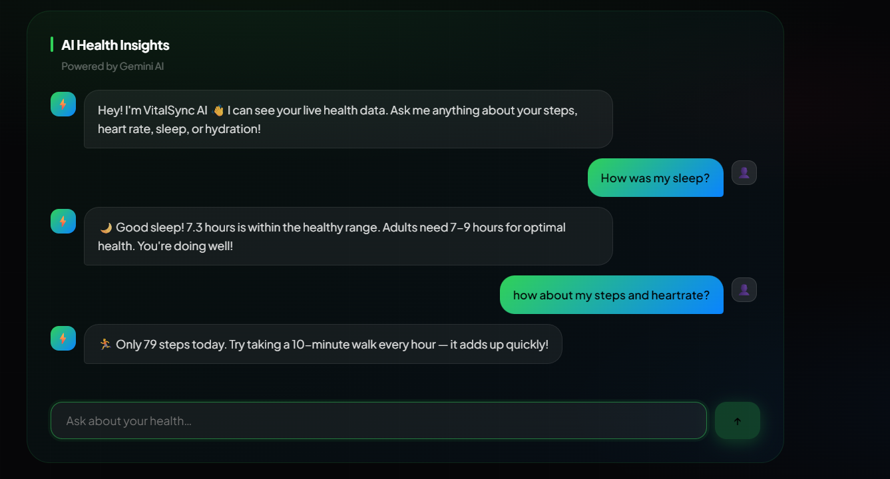
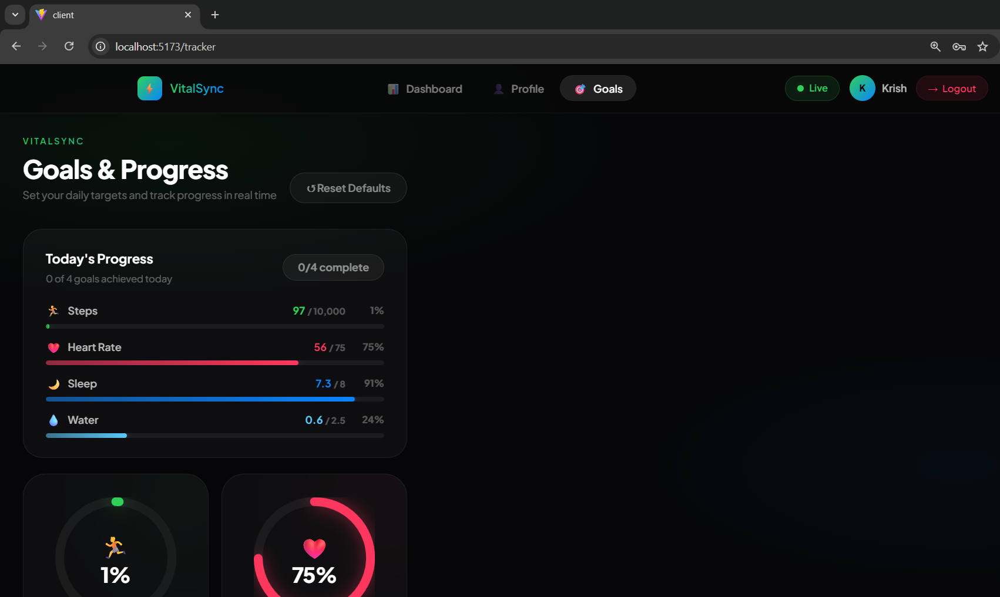
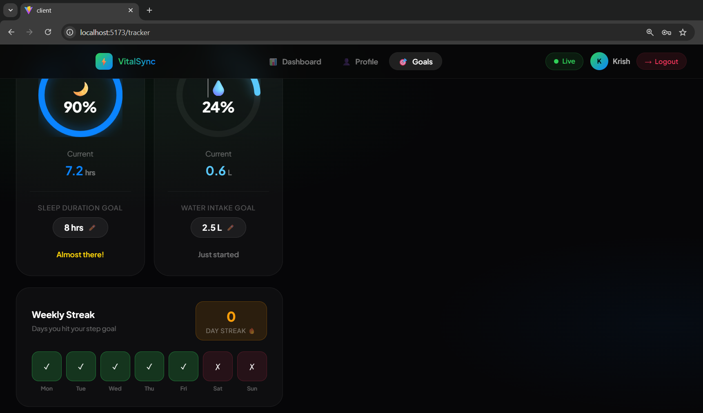
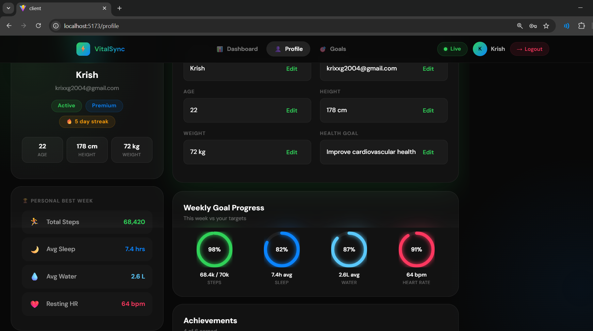
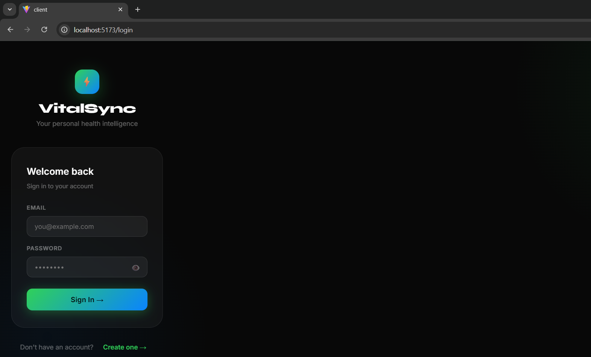
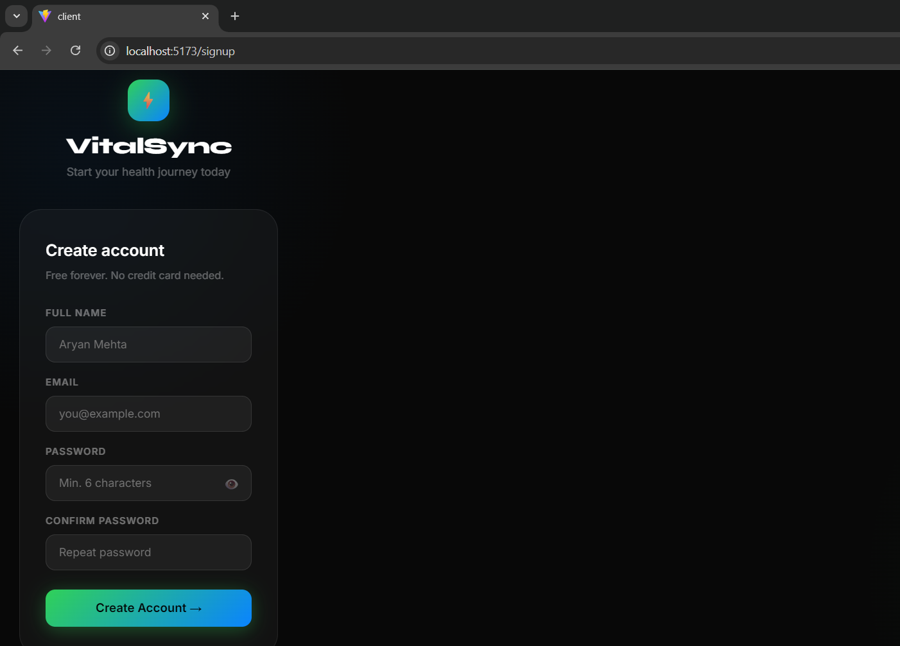

# ⚡ VitalSync — Personal Health Dashboard

A full-stack real-time health dashboard that aggregates wearable sensor data, visualises health metrics, and provides AI-powered conversational insights — all in a clean, modern interface.

---

## 📸 Screenshots

### Dashboard


### Dashboard — Charts & Insights


### AI Health Chatbot


### Goals & Progress Tracker




### Profile


### Login & Signup



---

## 🌟 Features

- **Real-Time Health Metrics** — Live data streaming via WebSocket updating every 5 seconds, simulating a connected wearable device
- **Interactive Charts** — Multi-metric trend charts with dual Y-axis, gradient fills, and smooth curve animations
- **AI Health Chatbot** — A home-built conversational assistant that reads your live data and responds to natural language questions about your health
- **Goals & Progress Tracker** — Set personalised daily targets for steps, heart rate, sleep, and hydration with animated radial rings and a weekly streak system
- **User Authentication** — Full JWT-based auth with bcrypt password hashing, protected routes, and auto token expiry
- **Profile Management** — Editable user profile with personal stats, weekly goal rings, and achievement badges
- **Responsive Dark UI** — Glassmorphism design with ambient gradients, animated metric rings, and smooth page transitions

---

## 🛠 Tech Stack

### Frontend
| Technology | Purpose |
|---|---|
| React 18 + Vite | UI framework and build tool |
| React Router v6 | Client-side navigation |
| Socket.io Client | Real-time WebSocket data |
| Chart.js + react-chartjs-2 | Health trend visualisation |
| CSS-in-JS (inline styles) | Component-scoped styling |

### Backend
| Technology | Purpose |
|---|---|
| Node.js + Express | REST API server |
| Socket.io | Real-time data broadcasting |
| MongoDB + Mongoose | Database and schema modeling |
| JWT + bcryptjs | Secure authentication |
| Nodemon | Development auto-restart |

---

## 🚀 Getting Started

### Prerequisites
- Node.js v18+
- MongoDB running locally or a MongoDB Atlas URI

### Installation

```bash
# Clone the repository
git clone https://github.com/krishgoswami83/vitalsync.git
cd vitalsync

# Install server dependencies
cd server
npm install

# Install client dependencies
cd ../client
npm install
```

### Environment Setup

Create a `.env` file inside the `server` folder:

```env
MONGODB_URI=mongodb://127.0.0.1:27017/wearable-dashboard
JWT_SECRET=your_secret_key_here
```

### Running the App

```bash
# Terminal 1 — Backend
cd server
npm run dev

# Terminal 2 — Frontend
cd client
npm run dev
```

Visit **http://localhost:5173**

---

## 📁 Project Structure

```
vitalsync/
├── client/                        # React frontend (Vite)
│   └── src/
│       ├── pages/
│       │   ├── Dashboard.jsx      # Real-time health dashboard
│       │   ├── Profile.jsx        # User profile & achievements
│       │   ├── Login.jsx          # Login page
│       │   ├── Signup.jsx         # Registration page
│       │   └── money.jsx          # Goals & progress tracker
│       ├── components/
│       │   ├── Navbar.jsx         # Top navigation bar
│       │   ├── HealthChart.jsx    # Multi-metric line chart
│       │   ├── AIInsights.jsx     # AI chatbot interface
│       │   ├── HealthAlerts.jsx   # Anomaly detection alerts
│       │   ├── HealthScore.jsx    # Overall health score
│       │   └── ProtectedRoute.jsx # JWT route guard
│       └── services/
│           └── api.js             # API helper functions
│
└── server/                        # Node.js + Express backend
    ├── controllers/
    │   ├── authController.js      # Register, login, JWT middleware
    │   ├── healthController.js    # Health data CRUD
    │   └── aiController.js        # Rule-based AI chatbot logic
    ├── models/
    │   ├── User.js                # User schema
    │   └── HealthData.js          # Health metrics schema
    ├── routes/
    │   ├── authRoutes.js
    │   ├── healthRoutes.js
    │   └── aiRoutes.js
    └── server.js                  # Server entry + Socket.io + data generator
```

---

## 🧠 How the AI Chatbot Works

The chatbot is entirely self-built — no external AI API. It uses regex pattern matching against the user's message and generates responses based on the actual live health values.

```
User: "how are my steps today?"
  → matches /step|walk|move/
  → checks: steps = 7,200 vs goal 10,000
  → responds: "Good progress! You're at 7,200 steps (72% of goal).
               You need 2,800 more — a short walk would do it!"
```

Topics covered: steps, heart rate, sleep, hydration, calories burned, stress levels, weekly tips, and overall health summary.

---

## 📡 Mock Data Generator

The backend simulates realistic wearable sensor data with time-aware patterns:

| Time | Behaviour |
|---|---|
| 6–9am | Steps accumulate fast (morning walk) |
| 12–1pm | Steps spike (lunch walk) |
| 5–7pm | Steps peak (evening activity) |
| 10pm–6am | Steps near zero (sleep) |
| Weekends | 35% fewer steps overall |
| Any time | Random HR spikes simulating exercise bursts |

---

## 🔮 Future Scope

This project is built with real integrations in mind. Here's what can be added:

### 🔗 Real Wearable Integrations
- **Fitbit API** — OAuth 2.0 integration to pull real steps, HR, sleep stages and SpO2 from any Fitbit device
- **Apple HealthKit** — Via a companion iOS Swift app that forwards HealthKit data to the Node.js backend in real time
- **Google Fit API** — REST API integration for Android wearables and Wear OS devices
- **Garmin Connect IQ** — SDK integration for Garmin smartwatches popular with athletes
- **Samsung Health SDK** — For Galaxy Watch users

### 🤖 AI & Analytics Upgrades
- Replace rule-based chatbot with a fine-tuned LLM for more nuanced health conversations
- Anomaly detection using ML models trained on personal baselines
- Weekly auto-generated PDF health reports
- Sleep stage analysis (REM, deep, light) from raw accelerometer data

### 📊 Dashboard Enhancements
- 30/90 day historical trend analysis
- Correlations between metrics (e.g. poor sleep → elevated HR next day)
- Calorie tracking and macro nutrition logging
- GPS route map for outdoor walks and runs

### 🏥 Clinical Features
- HL7 FHIR integration for sharing data with healthcare providers
- Medication reminder system
- Emergency alert system for abnormal vitals

---

## 👨‍💻 About

Built by **Krish Goswami** — Final Year Computer Science Student

This project was built to explore full-stack development, real-time systems, and health data visualisation. It demonstrates end-to-end product thinking — from data generation and API design to UI/UX and authentication.

---

## 📄 License

MIT — open source, feel free to fork and build on top of it.